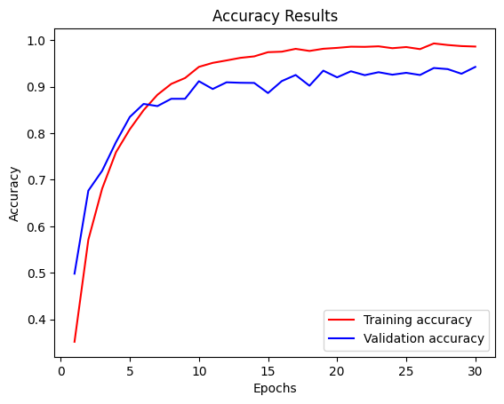
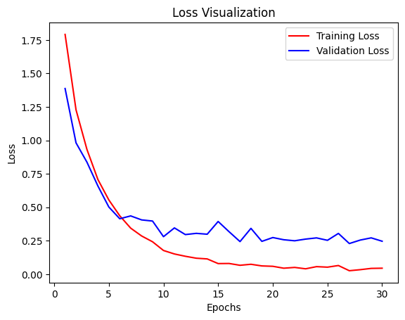
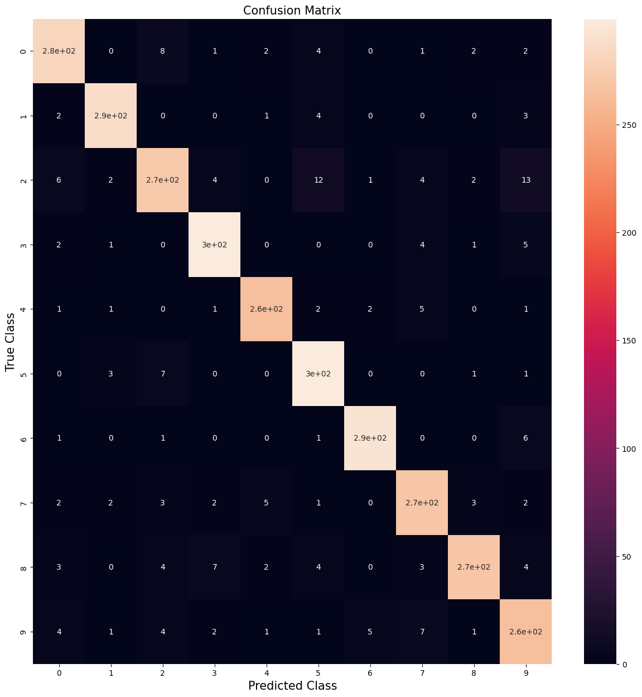

🎵 Music Genre Prediction Model
A deep learning model built with Python to predict music genres from audio files using the GTZAN dataset. This project utilizes a Convolutional Neural Network (CNN) for audio classification, leveraging the Librosa library for feature extraction and TensorFlow for building and training the model.

🚀 Features
Extracts MFCCs and other relevant audio features using Librosa

Trains a custom CNN model for genre classification

Uses the GTZAN dataset containing 10 music genres

Achieves accurate genre prediction on unseen audio samples

NOTE: this model works well with 90s songs, as all the songs in the dataset are of 90s

🧠 Tech Stack
Python

TensorFlow / Keras

Librosa

NumPy, Matplotlib, Scikit-learn

📁 Dataset
GTZAN Genre Collection: 1000 audio tracks (30 seconds each) across 10 genres.

📊 Genres Included
Blues, Classical, Country, Disco, Hip-hop, Jazz, Metal, Pop, Reggae, Rock

📦 How to Run
Clone the repository

Install dependencies from requirements.txt

Preprocess the dataset

Do the dataset pre-processing as I have done in music_genre.ipynb

Train the model using train.ipynb

Predict genre for new audio with test.ipynb

I HAVE UPLOADED THE WEIGHTS ON DRIVE YOU CAN DOWNLOAD FROM [HERE](https://drive.google.com/file/d/1YZQLdQW25DreKn6x7qj-rPSyAvKzjT8A/view?usp=sharing)

Below are the Accuraccy, Loss and Confusion Matrix graph

 

 

 
